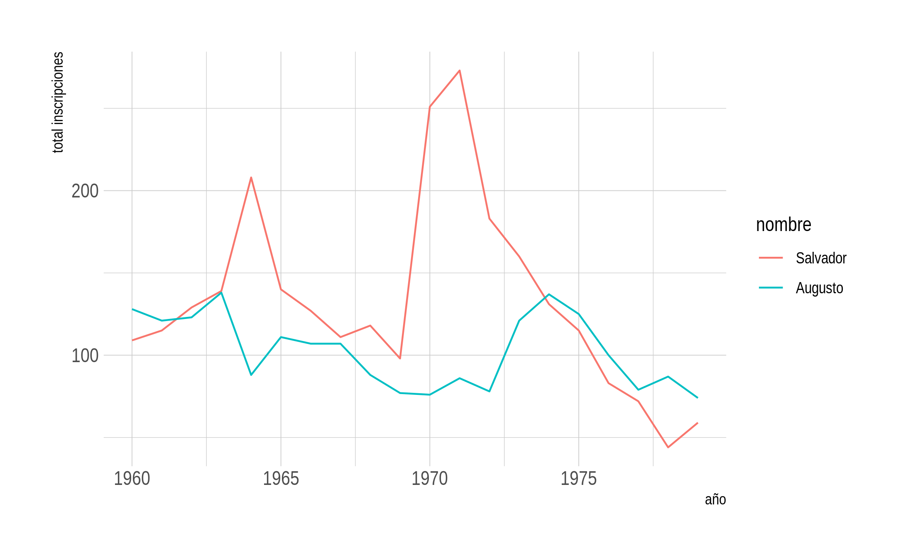
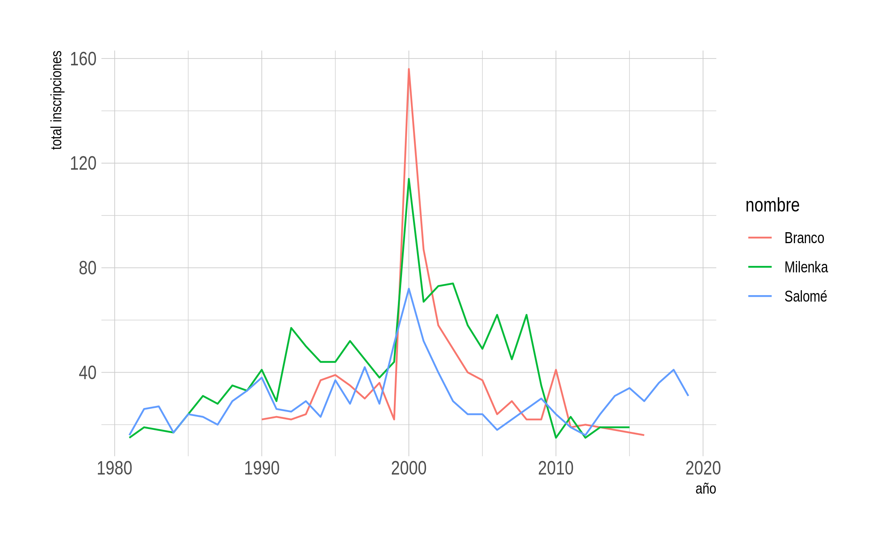
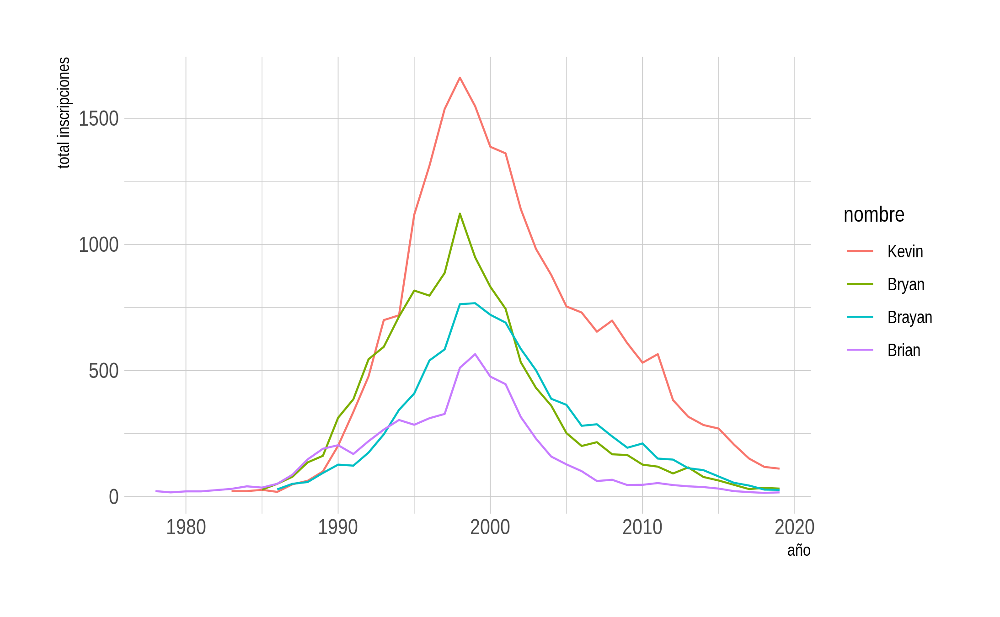
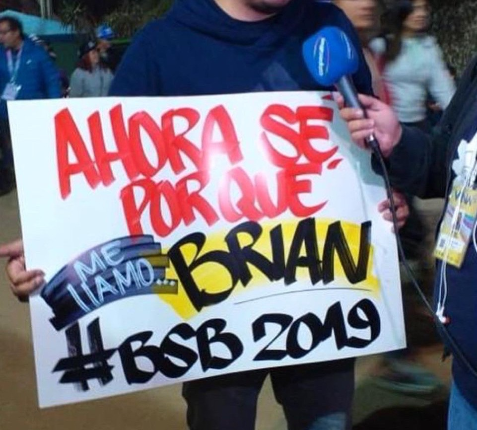

<!-- README.md is generated from README.Rmd. Please edit that file -->

# guaguas 

<!-- badges: start -->

[](https://CRAN.R-project.org/package=guaguas)
[](https://github.com/rivaquiroga/guaguas/actions)
<!-- badges: end -->

Datos sobre nombres de guaguas (bebés) registrados en Chile entre 1920 y
2020, según el Servicio de Registro Civil e Identificación. Incluye solo
los que fueron inscritos como primer nombre. Este *dataset* permite
explorar tendencias en los nombres registrados durante el último siglo y
puede utilizarse como fuente de ejemplos para aprender/enseñar a
trabajar con datos.

## Instalación

El paquete `guaguas` puede instalarse directamente desde CRAN:

``` r
install.packages("guaguas")
```

La versión en desarrollo puede instalarse desde Github:

``` r
# install.packages("devtools")
devtools::install_github("rivaquiroga/guaguas")
```

## Datos

El dataframe `guaguas` contiene 845400 observaciones para cinco
variables:

| variable     | descripción                                                       |
|--------------|-------------------------------------------------------------------|
| `anio`       | año de inscripción                                                |
| `nombre`     | el nombre inscrito                                                |
| `sexo`       | sexo registral                                                    |
| `n`          | número de ocurrencias del nombre                                  |
| `proporcion` | proporción del nombre respecto del total de inscripciones del año |

El dataframe `guaguas_frecuentes` contiene una muestra de 85463
observaciones, que corresponden a los nombres con al menos 15
ocurrencias por año.

## Ejemplos

A continuación se muestran algunos ejemplos de exploración de estos
datos.

#### El contexto político en los años sesenta y setenta

Los dos momentos en que aumentan las inscripciones con el nombre
*Salvador* en los años sesenta y setenta coinciden con elecciones
presidenciales en las que se presentó Salvador Allende como candidato
(1964, 1970). El año siguiente de su elección como presidente (1971) es
el año con mayor cantidad de inscripciones en esas décadas. Luego del
Golpe Militar los registros comienzan a bajar y encuentran su punto más
bajo en 1978. El nombre *Augusto*, por su parte, sube en los registros
en 1973 y 1974, pero luego su popularidad baja.

``` r
library(guaguas)
library(dplyr)
library(stringr)
library(ggplot2)
library(forcats)
library(hrbrthemes)
library(ggthemes)

guaguas %>% 
  filter(nombre %in% c("Salvador", "Augusto"), anio >= 1960 & anio <= 1979) %>% 
  ggplot(aes(anio, n, color = fct_reorder2(nombre, n, anio))) + 
  geom_line() +
  scale_color_colorblind() +
  labs(x = "año", y = "total inscripciones", color = "nombre", 
       title = "Inscripciones de 'Salvador' y 'Augusto' entre 1960 - 1979") +
  theme_ipsum()
```



#### El efecto “Romané” en el año 2000

Según [IMDB](https://www.imdb.com/list/ls006742360/),
[Romané](https://es.wikipedia.org/wiki/Roman%C3%A9) ha sido una de las
teleseries más vistas en Chile. Emitida el año 2000, el nombre de su
protagonista tiene un incremento en las inscripciones de ese año.

``` r
guaguas %>% 
  filter(str_detect(nombre, "(Y|J)ovanka"), n >= 10)
#> # A tibble: 8 x 5
#>    anio nombre  sexo      n proporcion
#>   <dbl> <chr>   <chr> <dbl>      <dbl>
#> 1  1963 Jovanka F        17  0.0000595
#> 2  1973 Yovanka F        16  0.0000507
#> 3  1974 Yovanka F        10  0.0000326
#> 4  1992 Yovanka F        11  0.0000371
#> 5  1993 Yovanka F        10  0.0000341
#> 6  2000 Jovanka F        30  0.000118 
#> 7  2000 Yovanka F        21  0.0000828
#> 8  2001 Yovanka F        11  0.0000437
```

También aumentaron las inscripciones de nombres de otros personajes de
la teleserie:

``` r
guaguas %>% 
  filter(nombre %in% c("Milenka", "Branco", "Salomé"), anio > 1980) %>% 
  ggplot(aes(anio, n, color = nombre)) + 
  geom_line() +
  scale_color_colorblind() +
  labs(x = "año", y = "total inscripciones",
       title = "Inscripciones de nombres de personajes de 'Romané'") +
  theme_ipsum()
```



#### El efecto Backstreet Boys

Alguno de los nombres de integrantes de los [Backstreet
Boys](https://es.wikipedia.org/wiki/Backstreet_Boys) aumentaron hacia
fines de la década de los noventa. Como suele ocurrir con nombres en
inglés, es posible encontrar variaciones en la forma de escribirlos:
*Brian*, *Bryan*, *Brayan*.

``` r
guaguas %>% 
  filter(nombre %in% c("Brian", "Kevin", "Bryan", "Brayan"), sexo == "M") %>% 
  ggplot(aes(anio, n, color = fct_reorder2(nombre, anio, n))) +
  geom_line() +
  scale_color_colorblind() +
  labs(x = "año", y = "total inscripciones", color = "nombre",
       title = "El efecto 'Backstreet Boys'") +
  theme_ipsum()
```



<p align="center">

</p>
<p align="center">
Un cartel visto durante la presentación de los Backstreet Boys en el
Festival de Viña del Mar 2019.
Fuente:<a href="https://www.fmtiempo.cl/tendencias/galeria-los-mejores-carteles-que-dejo-el-paso-de-los-backstreet-boys-en-vina/">
FMTiempo</a>
</p>

## Fuente de los datos

Los datos fueron obtenidos a través del Portal de Transparencia del
Sistema de Registro Civil e Identificación de Chile.

## Etimología

La palabra *guagua* viene del quechua *wawa* y es la forma que en Chile
y algunos países de Sudamérica se utiliza para referirse a un/a bebé.

## Paquetes similares

-   [`babynames`](https://github.com/hadley/babynames): nombres
    registrados en EE. UU.
-   [`prenoms`](https://github.com/ThinkR-open/prenoms): nombres
    registrados en Francia.
-   [`ukbabynames`](https://github.com/mine-cetinkaya-rundel/ukbabynames):
    nombres registrado en el Reino Unido.
