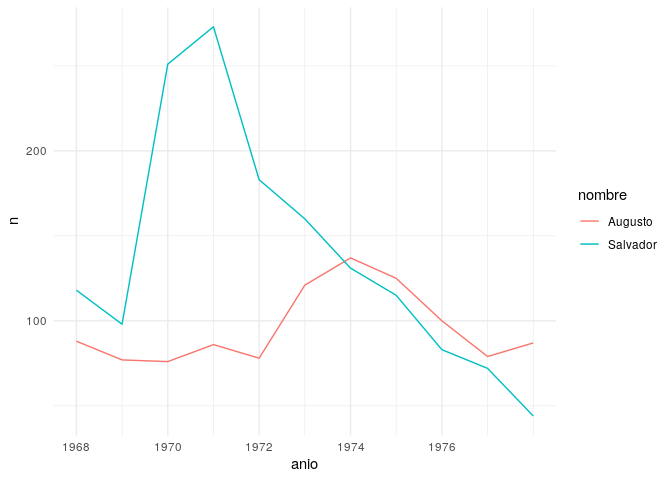
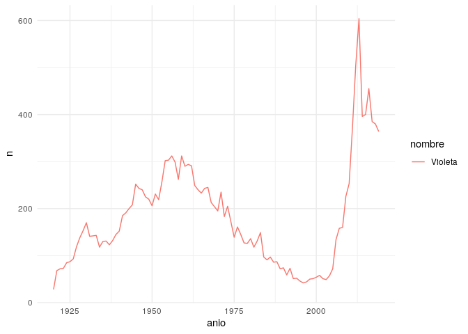

<!-- README.md is generated from README.Rmd. Please edit that file -->

# guaguas

<!-- badges: start -->

[](https://CRAN.R-project.org/package=guaguas)
[](https://travis-ci.com/rivaquiroga/guaguas)
<!-- badges: end -->

Datos de nombres de guaguas (bebés) registrados en Chile entre 1920 y
2019, según el Servicio de Registro Civil e Identificación. Incluye
todos los nombres con al menos 15 ocurrencias.

El dataframe `guaguas` contiene cuatro variables: año de inscripción,
sexo registral, nombre, número de ocurrencias del nombre y proporción
del nombre respecto del total de inscripciones del año.

## Instalación

``` r
# install.packages("devtools")
devtools::install_github("rivaquiroga/guaguas")
```

## Ejemplos

``` r
library(guaguas)
library(dplyr)
library(ggplot2)
library(stringr)


guaguas %>% 
  filter(nombre %in% c("Salvador", "Augusto"), anio >= 1968 & anio <= 1978) %>% 
  ggplot(aes(anio, n, color = nombre)) + 
  geom_line() +
  scale_x_continuous(breaks = c(1968, 1970, 1972, 1974, 1976)) +
  theme_minimal()
```



``` r
  
guaguas %>% 
  filter(nombre == "Violeta") %>% 
  ggplot(aes(anio, n, color = nombre)) + 
  geom_line() +
  theme_minimal()
```



El efecto de la teleserie “Romané” el año 2000:

``` r
guaguas %>% 
  filter(str_detect(nombre, "(Y|J)ovanka"))
#> # A tibble: 4 x 5
#>    anio sexo  nombre      n proporcion
#>   <dbl> <chr> <chr>   <int>      <dbl>
#> 1  1963 F     Jovanka    17  0.0000597
#> 2  1973 F     Yovanka    16  0.0000506
#> 3  2000 F     Jovanka    30  0.000116 
#> 4  2000 F     Yovanka    21  0.0000813
```

El efecto Britney Spears:

``` r
guaguas %>% 
  filter(str_detect(nombre, "Britney")) 
#> # A tibble: 2 x 5
#>    anio sexo  nombre      n proporcion
#>   <dbl> <chr> <chr>   <int>      <dbl>
#> 1  2000 F     Britney    21  0.0000813
#> 2  2008 F     Britney    19  0.0000739
```

## Etimología

La palabra *guagua* viene del quechua *wawa* y es la forma que en Chile
y algunos países de Sudamérica se utiliza para referirse a un/a bebé.

## Fuente de los datos

Los datos fueron obtenidos a través del Portal de Transparencia del
Sistema de Registro Civil e Identificación.

## Paquetes similares

  - [`babynames`](https://github.com/hadley/babynames) (nombres
    registrados en EE. UU.)
  - [`prenoms`](https://github.com/ThinkR-open/prenoms) (nombres
    registrados en Francia)
